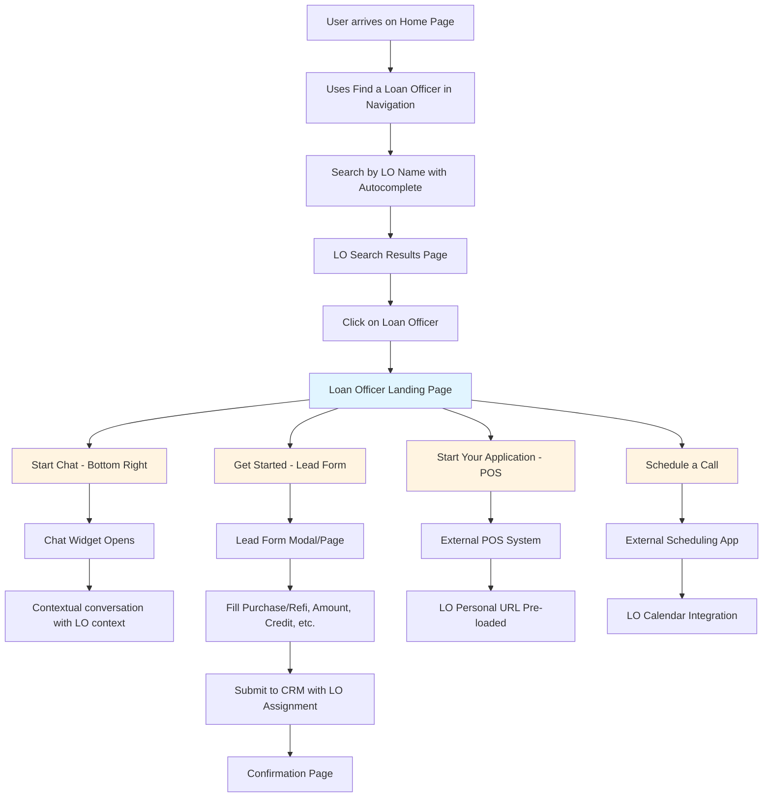
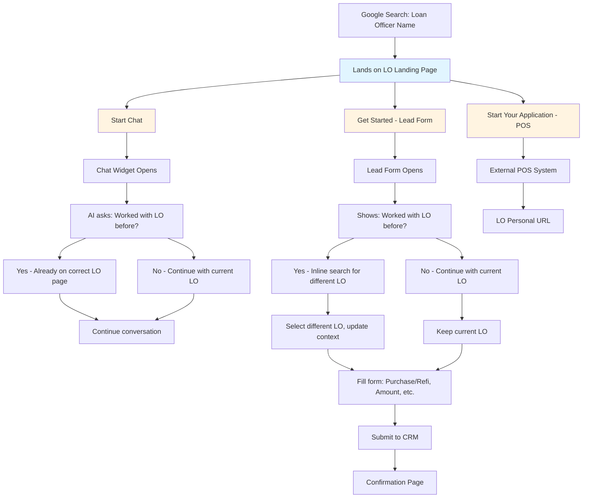
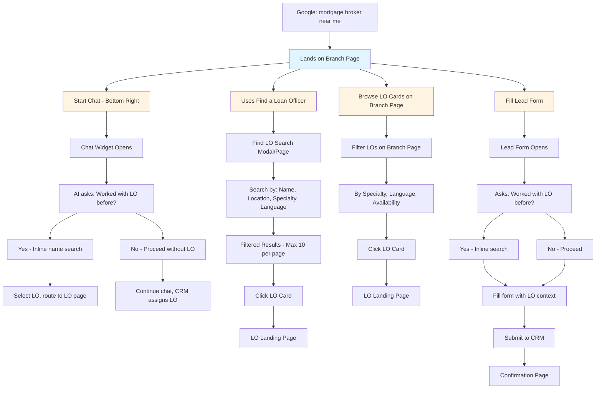
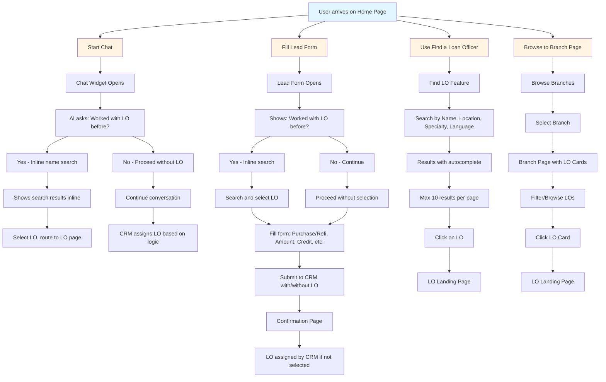

# Loan Officer Experience - User Journeys

## Journey 1: Referred User with LO Name Only

**Context:** User has a loan officer's name from a friend's referral

## Journey 2: Direct Google Search to LO Landing Page

**Context:** User googles loan officer's name and lands directly on their page

## Journey 3: Google Search Leads to Branch Page

**Context:** User searches "mortgage broker near me" and finds a branch location

## Journey 4: User Without LO Preference

**Context:** User arrives on home page without a specific loan officer in mind

## Key Interaction Points

### Chat Widget
- Always visible in bottom right corner
- AI-powered chatbot
- Always asks: "Have you worked with a loan officer before?"
- If yes: Inline name search to find their LO
- If no: Proceed with conversation, CRM handles assignment
- Can route to LO Landing Page

### Lead Form Fields
1. **Loan Type:** Purchase or Refinance
2. **Loan Amount:** Dollar input
3. **Credit Score:** Self-assessment (Excellent, Good, Fair, Poor)
4. **Down Payment / Equity:** Percentage or dollar amount
5. **Property Address:** Address autocomplete
6. **Contact Information:** Name, Email, Phone
7. **LO Selection:** "Have you worked with a loan officer?" (Yes/No with inline search)

### Find a Loan Officer Search
- **Search Fields:** Name, Location, Zip Code, Specialty, Language
- **Autocomplete:** As user types
- **Results:** Maximum 10 per page with pagination
- **Display:** Card format with photo, name, NMLS, title, contact, specialties

### Loan Officer Landing Page CTAs
1. **Chat:** Bottom right widget (always visible)
2. **Get Started:** Opens lead form
3. **Start Your Application:** Links to external POS system (LO personal URL)
4. **Schedule a Call:** Links to LO scheduling app

### Assignment Logic
When user proceeds **without** selecting a loan officer:
- Form/chat data submitted to CRM
- CRM assigns LO based on:
  - Geography
  - Availability
  - Specialization match
  - Round-robin or custom business rules
